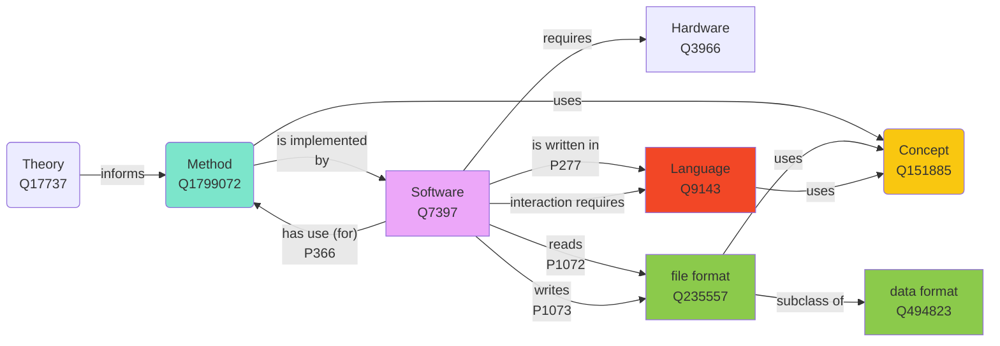

[](https://results.pre-commit.ci/latest/github/FuReSH/tool-storage-metadata/main)
[](https://github.com/FuReSH/tool-storage-metadata/actions/workflows/test-your-data.yml)

Dieser Ordner enthält die Daten zu unserem metaphorischen Werkzeugregal. Dahinter steht die Idee die Metaphern von Werkzeugen, Werkzeugkoffern, Werkzeugregalen, Blackboxes mit physischen Objekten pädagogisch nutzbar zu machen. So gibt es in unserem *Scholarly Makerspace* ein **Werkzeugregal** in dem sich **Werkzeugkisten** und **Blackboxes** befinden. Werkzeugkisten sind nach Typen (Kategorien) von Werkzeugen, z.B. "Programmiersprachen" oder "Dateiformate", und Blackboxes nach Themen, z.B. "Web Scraping" oder "Distant Reading", gepackt.

Der Begriff des Werkzeuges ist hier so weit wie möglich gefasst und umfasst Methoden, Konzepte, Software, Sprachen, Hardware etc.

# To do

- Schemas
    - [ ] Das Schema erscheint mir (TG) bei den Datentypen zu strikt zu sein, so würde YAML eigentlich String oder Arrays zulassen und Strings einfach als Arrays mit einem Eintrag ansehen. Mit dem Schema ist dies aber nicht zulässig.
    - [x] Wie ist "Name" zu verstehen?
        + Als kanonischer Identifier in unserem System?
            * dann braucht es einen weiteres Feld für potentiell plurale Bezeichnungen einer Sache
            * Ist z.B. eine "IDE" als `name: IDE` der `name: Integrated Development Environment` zu beschreiben?
        + als eine mögliche Bezeichnung der beschriebenen Sache?
            * das ließe sich dann besser automatisiert von Wikidata und in mehreren Sprachen abgreifen
        - [ ] Vorschläge
            - [ ] allow multiple names
                - [ ] each with a `lang` child, which should follow the BCP-47 standard
        - **Solved:** Der key "name" ist die "sprechende" Id unseres tools, die auch dem Dateinamen entspricht. So kann man später bei einer Formulareingabe einfach nach Duplikaten prüfen und die Datei im Repo anlegen.

- Dokumentation
    - [x] Kurze Beschreibung der Einrichtung von VSCode etc., damit YAML Dateien mit dem JSON Schema validiert werden
    - [ ] Beschreibung des Workflows für das Anlegen neuer Werkzeuge
    - [ ] Beschreibung der Rationales hinter unseren Infrastrukturentscheidungen

# Ordnerstruktur

- `blackboxes/`: Ordner für von uns gepackte / vorbereitete Blackboxes. Für jede Blackbox gibt es
    + eine YAML Datei (`blackbox.yml`) und
    + eine visuelle Übersicht über den Inhalt und wie er zusammengehört (`blackbox_schema.jpg`).
- `schemas/`: Ordner für JSON Schemata zur Validierung der YAML Dateien
- `tools/`: Ordner für die einzelnen Werkzeuge

# Set-up für dieses Repo

Der Kern unserer Infrastruktur sind YAML Dateien. Da YAML ein Superset von JSON ist, lassen sich YAML Dateien mit JSON schemas validieren. Dafür muss in der Software unserer Wahl ein Linter eingerichtet werden.

## SublimeText

In Sublime Text stellt das Package [SublimeLinter](http://www.sublimelinter.com) eine Plug-in Infrastruktur für Linter zur Verfügung. Diese müssen aber für alle Sprachen einzelen installiert werden.

Für YAML gibt es das Package [SublimeLinter-contrib-yamllint](https://github.com/thomasmeeus/SublimeLinter-contrib-yamllint), das ein Interface zu der Python library [yamllint]() bereitstellt. Letzteres kann mit `pip install yamllint` installiert werden. Allerdings biete yamllint keine Validierung mit JSON schemas

## VSCode

In VSCode gibt es eine [YAML Extension](https://marketplace.visualstudio.com/items?itemName=redhat.vscode-yaml), die die notwendige Funktionalität bietet. Siehe zur Einrichtung auch die Dokumentation auf GitHub: [vscode-yaml](https://github.com/redhat-developer/vscode-yaml)

# Werkzeuge

Dabei gibt es pro Werkzeug eine YAML Datei. Diese wird über ein [JSON Schema](schemas/tool.schema.json) validiert und muss neben einem Werkzeugnamen  eine Wikidata ID enthalten und mit mindestens einer unserer lokalen Kategorie kategorisiert sein. Daneben kann sie   Kurzbeschreibung, weiterführende Links, Links zu Icons etc. enthalten. Dafür wird es ein template geben. Um das Auflösen von URLs zu erleichtern, sind die Dateinamen einfach `[WERKZEUG].tool.yml` also z.B. `docker.tool.yml`. Dateinamen werden grundsäztlich kleingeschrieben und Lehrzeichen durch Bindestriche ersetzt.
Weitere Informationen bzw. andere Arten von Informationen zu Werkzeugen werden in Markdown-Dateien (`.md`) mit funktionalen Zusätzen zum Dateinamen festgehalten, wie z.B. `_tutorial`. Entwürfe werden mit dem Zusatz `_draft` versehen.

## Unser Werkzeugbegriff

- Methoden bzw. **Verfahren** sind durch **Theorien** informiert und haben einen *Zweck*.
- **Verfahren** werden in (mehreren Schichten von) **Software** implementiert, die je eigene Anforderungen an **Hardware** stellt, und mit **Formaten** interagiert (lesen, schreiben).
- **Software** ist in **Sprachen** geschrieben und benötigt im fall von CLIs **Sprachen** zur Interaktion.
- **Verfahren**, **Sprachen** und **Formate** bedienen sich und implementieren abstrakte **Konzepte**
- Bei **Formaten** unterscheiden wir nicht zwischen Dateiformaten und Datenserialisierungen.

Das folgende Diagramm visualisiert diese Beziehungen und gibt Wikidata *Items* und *Properties* an



## YAML

Beispiel einer minimalen YAML Datei

```yml
---
# yaml-language-server: $schema=../schemas/tool.schema.json
name: Docker
wikidataId: Q15206305
category:
  - software
```

## Setkarten

Jedes Werkzeug wird durch eine Setkarte dargestellt.


Jede Setkarte enthält die folgenden Informationen:

- Name und Auflösung (im Fall von Abkürzungen)
- Icon: kann über Wikidata oder TAPoR gefunden werden.
- QR Code: verweist auf eine feste URI; erlaubt das Ergebnis mit dem Handy zu scannen und weiterzuverarbeiten
- unsere Kategorien: s.o.
- ID(s)
    + unsere
    + Wikidata
    + TAPor
- Kategorien gemäß TaDiRAH? bei Verfahren und Software.
- Kurbeschreibung: kann von Wikidata oder/und TAPoR übernommen werden. Es besteht die Möglichkeit darüber Setkarten in verschiedenen Sprachen zu erzeugen
- Literatur: aus Zotero übernommen
- Weiterführende Links
- Input und Output

Die Farbgebung codiert eine basala Kategorisierung. Die Verteilung der Informationen auf Vorder- und Rückseite steht noch nicht fest.

Blackboxes können ähnliche Setkarten bekommen


## Erstellung der Setkarten

Wir stellen uns einen mehrheitlich automatisierten Prozess der Erstellung der Setkarten auf der Basis der Informationen in unserer *tool registry* vor, dabei wird jedes Werkzeug mit einer einzelnen YAML Datei beschrieben.


# Blackboxes

Blackboxes sind vor allem Methoden und Konzepte und nicht einzelne Werkzeuge, also "Web Scraping" und nicht "Python". Für jede Blackbox gibt es Input / Output und eine Menge Inhalt. Jede Blackbox hat auch einen Setkarte im Werkzeugregal, aus der Informationen gezogen werden können.
Wie gehabt, werden Blackboxes mit YAML-Dateien beschrieben. Dazu gibt es eine eine visuelle Übersicht über den Inhalt und wie er zusammengehört. Dieser macht von der schematischen Ansicht unserer Setkarten Gebrauch.


~~Die YAML-Datei kann entweder ein vollständiges Subset unserer *tool directory* sein oder stark reduziert. In letzterem Fall muss sie für die Menschenlesbarkeit immer auch einen Namen enthalten. Details sind in den Dokumenten zur technischen Infrastruktur spezifiziert.~~
